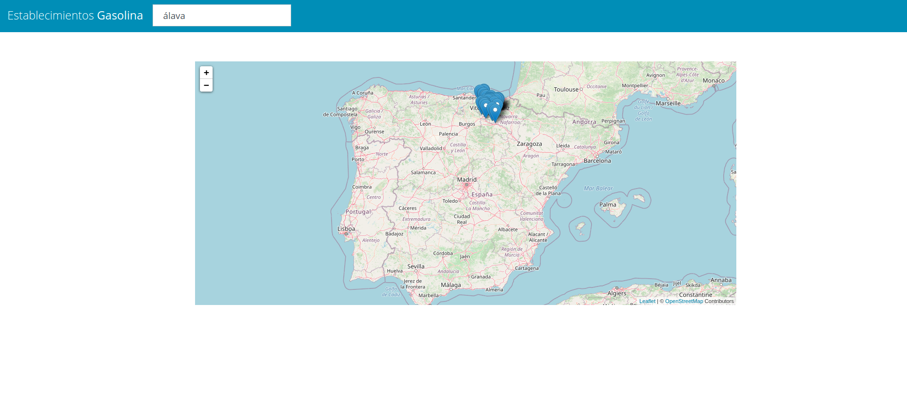

### · Small exercise to practice with the JavaScript library Leaflet  ·

Based on the [Udemy Course](https://www.udemy.com/course/javascript-moderno-guia-definitiva-construye-10-proyectos) given by [Juan Pablo de la Torre Valdez](https://twitter.com/JuanDevWP).

        

